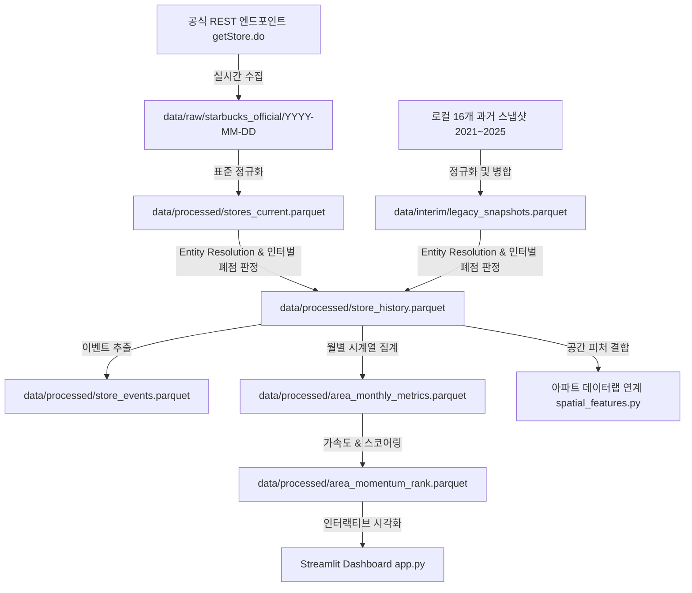

# 스타벅스 전국 매장 시계열 데이터 파이프라인 및 상권 변화 분석 시스템

## 1. 프로젝트 목적 및 가설

본 프로젝트는 스타벅스 전국 매장의 **개점·폐점·순증가·입지 이동(Relocation)** 데이터를 기반으로 지역별 상권 변화 속도와 확장 모멘텀을 추적하는 시계열 분석 시스템입니다.

> **핵심 가설:**  
> 스타벅스 매장은 아파트 가격 상승의 직접적 인과 요인이라기보다는, **상권 규모, 유동인구, 배후 소비력 및 상업지 성숙도를 종합적으로 보여주는 강력한 보조 프록시(Proxy) 지표**로 해석합니다.

---

## 2. 시스템 아키텍처 및 파이프라인

기존 Selenium 브라우저 크롤링 방식을 전면 개편하여, 스타벅스코리아 공식 REST 엔드포인트를 직접 연동하고 기보유 5개년 스냅샷(2021~2025)을 결합하여 고정밀 시계열을 구축했습니다.



---

## 3. 디렉토리 구조

```text
starbucks/
│
├─ legacy/                    # 기존 레거시 코드 안전 격리 보존
│   ├─ starbucks_01.py
│   ├─ starbucks_02.py
│   ├─ starbucks_eda.py
│   └─ compare_2024_2025.py
│
├─ src/
│   ├─ collectors/
│   │   └─ starbucks_official.py    # 공식 REST API 수집기 & 불변 스냅샷 관리
│   │
│   ├─ processing/
│   │   ├─ normalize.py            # 과거 스냅샷 자동 탐색 및 정규화
│   │   ├─ entity_resolution.py    # RapidFuzz + Haversine 종합 매칭 엔진
│   │   └─ history_builder.py      # 매장 생애주기 및 폐점/이전 이벤트 구축
│   │
│   ├─ features/
│   │   ├─ commercial_momentum.py  # 월별 시계열 및 SB Momentum Score 산출
│   │   └─ spatial_features.py     # 아파트/부동산 좌표 연계 공간 피처 함수
│   │
│   └─ analysis/
│       └─ eda.py                  # 종합 EDA 및 품질/분석 리포트 자동 생성
│
├─ data/
│   ├─ raw/starbucks_official/     # 수집 원본 JSON (날짜별 보존)
│   ├─ snapshots/                  # 불변(Immutable) 스냅샷 및 index
│   ├─ interim/                    # legacy_snapshots.parquet
│   └─ processed/                  # stores_current, store_history, metrics 등
│
├─ reports/
│   ├─ match_audit.csv             # Entity Resolution 매칭 감사 로그
│   ├─ data_quality_report.md      # 데이터 무결성 및 정합성 검증 리포트
│   └─ analysis_report.md          # 8대 질문 답변 및 심층 분석 리포트
│
├─ tests/
│   └─ test_pipeline.py            # 무결성 검증 pytest 테스트 스위트
│
├─ app.py                          # Streamlit 인터랙티브 대시보드
├─ requirements.txt
└─ README.md
```

---

## 4. 실행 가이드

### 4.1 의존성 패키지 설치
```bash
pip install -r requirements.txt
```

### 4.2 전체 파이프라인 순차 실행
```bash
# 1. 공식 최신 매장 수집 및 당일 스냅샷 생성
python -m src.collectors.starbucks_official

# 2. 과거 스냅샷(2021~2025) 정규화 및 통합
python -m src.processing.normalize

# 3. 매장 생애주기(개점/폐점/이전) 및 매칭 감사 로그 구축
python -m src.processing.history_builder

# 4. 월별 시계열 생성 및 SB Momentum Score 산출
python -m src.features.commercial_momentum

# 5. 종합 EDA 실행 및 마크다운 리포트 생성
python -m src.analysis.eda

# 6. 파이프라인 무결성 단위 테스트 검증
pytest -v tests/test_pipeline.py
```

### 4.3 Streamlit 대시보드 구동
```bash
streamlit run app.py
```

---

## 5. 핵심 분석 지표 정의 (Commercial Momentum)

1. **현재 매장 수 (`store_count_current`)**: 기준 시점 운영 매장 총합
2. **최근 12M 순증감 (`net_change_12m`)**: `opened_12m - closed_12m`
3. **직전 12M 순증감 (`net_change_prev_12m`)**: 13~24개월 전 순증감
4. **출점 가속도 (`opening_acceleration`)**:  
   $$\text{Acceleration} = \text{net\_change\_12m} - \text{net\_change\_prev\_12m}$$
5. **폐점 압력 (`closure_pressure`)**: $\text{closed\_12m} / \text{store\_count\_12m\_ago}$
6. **SB Commercial Momentum Score (0 ~ 100)**:  
   - 35% 최근 12M 순증감 (백분위 순위)
   - 25% 출점 가속도 (백분위 순위)
   - 15% 신규 상권 최초 진입 보너스
   - 15% 최근 24M 지속 성장성
   - 10% 폐점 압력 역점수
